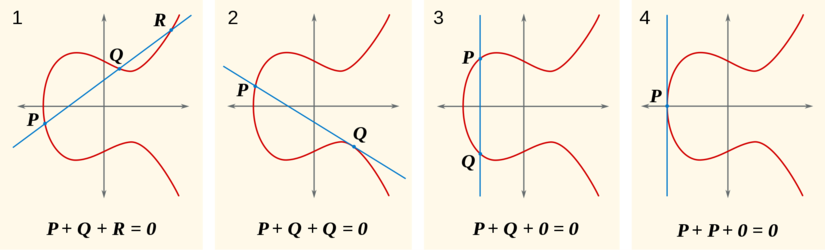

# Elliptic Curves

Implementation of modular elliptic curve arithmetic and cryptographic functions.

## Supported operations
### Gec.ModularArithmetic
- `pointAdd (2,3,97) (3,6) (12,3) --> (39,6)`
- `pointScale (2,3,97) 347 (3,6) --> (80,10)`


## Running Tests
```bash
$ ghci modular-arithmetic
> runTests
```
